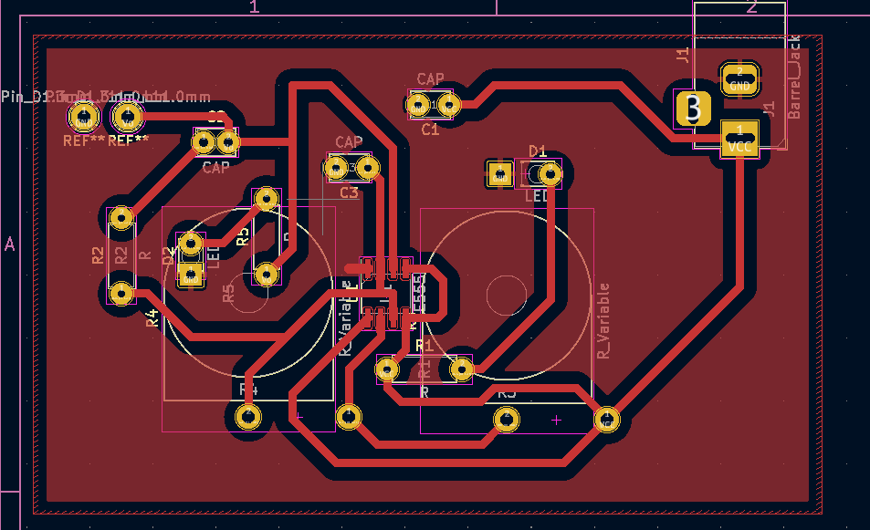
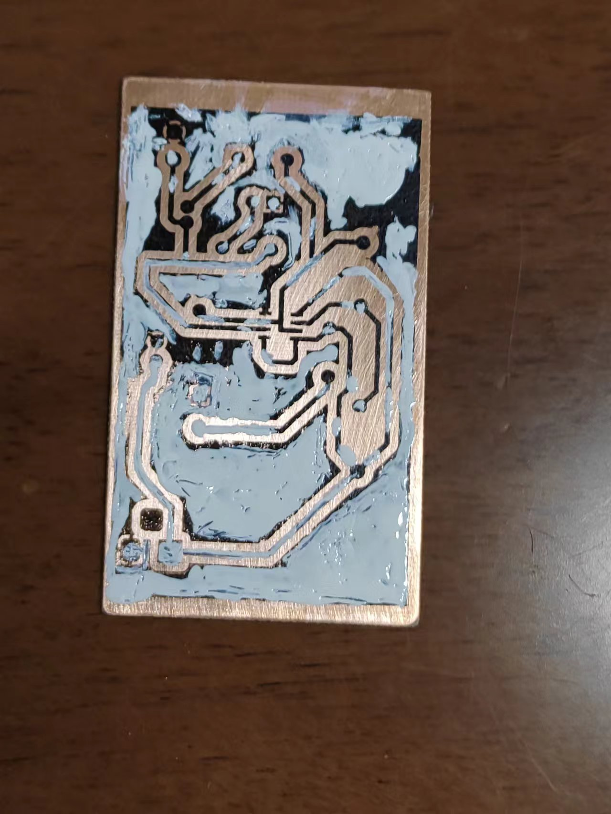
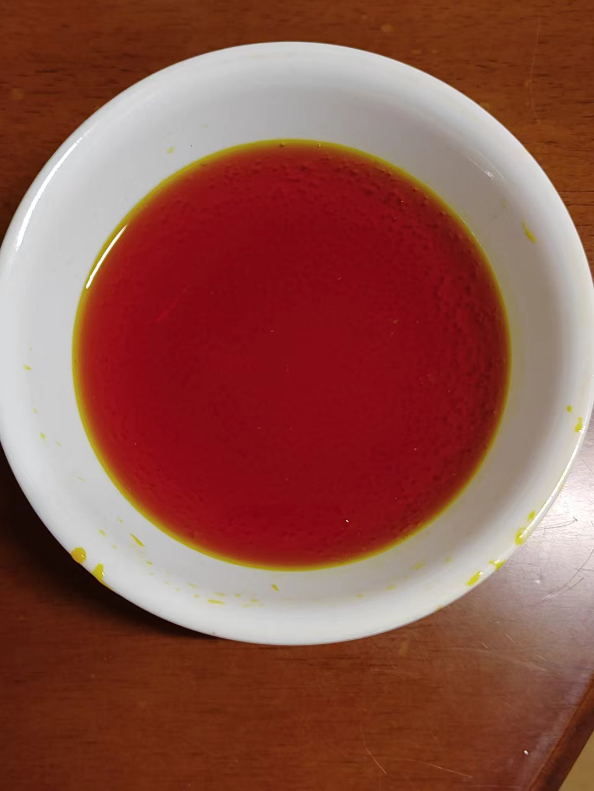
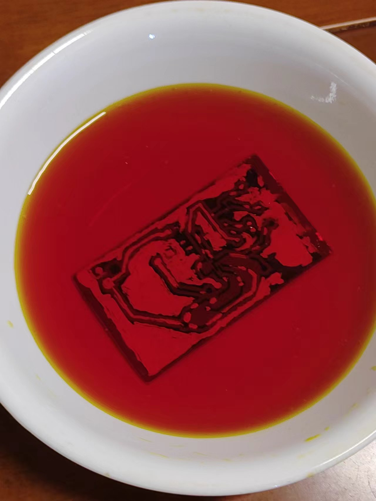
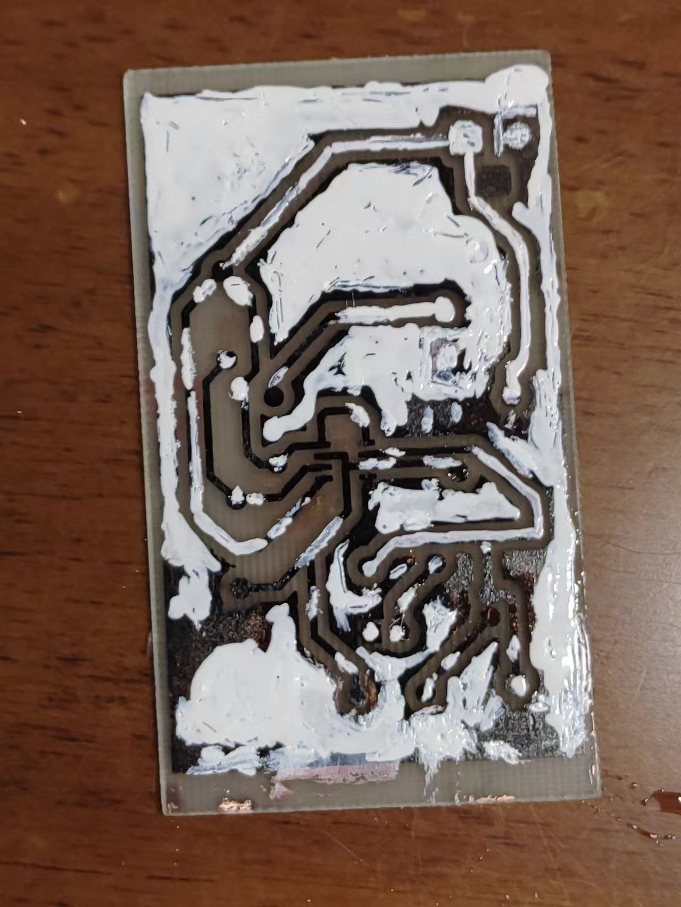
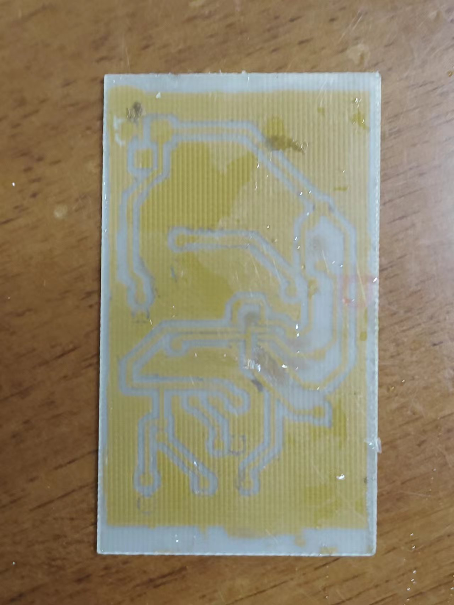
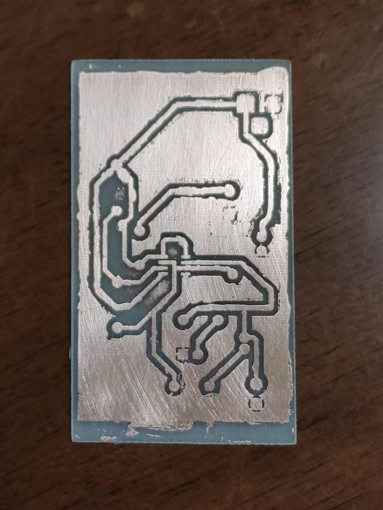
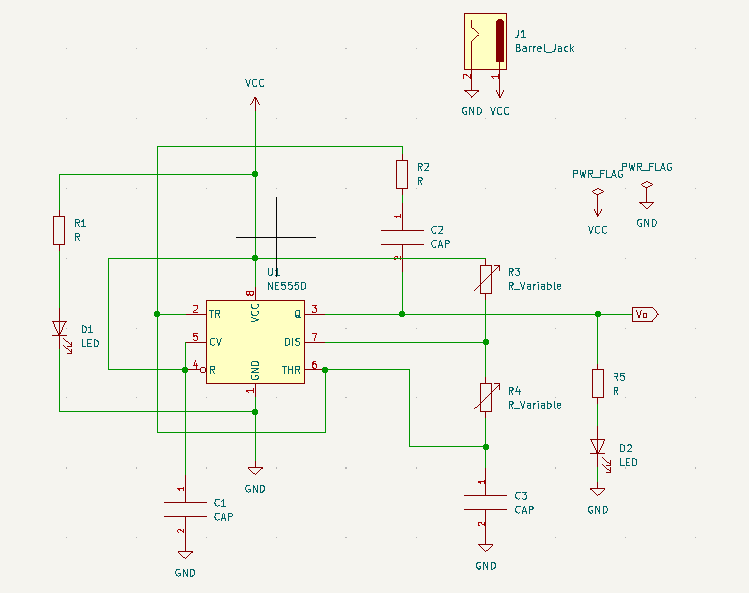
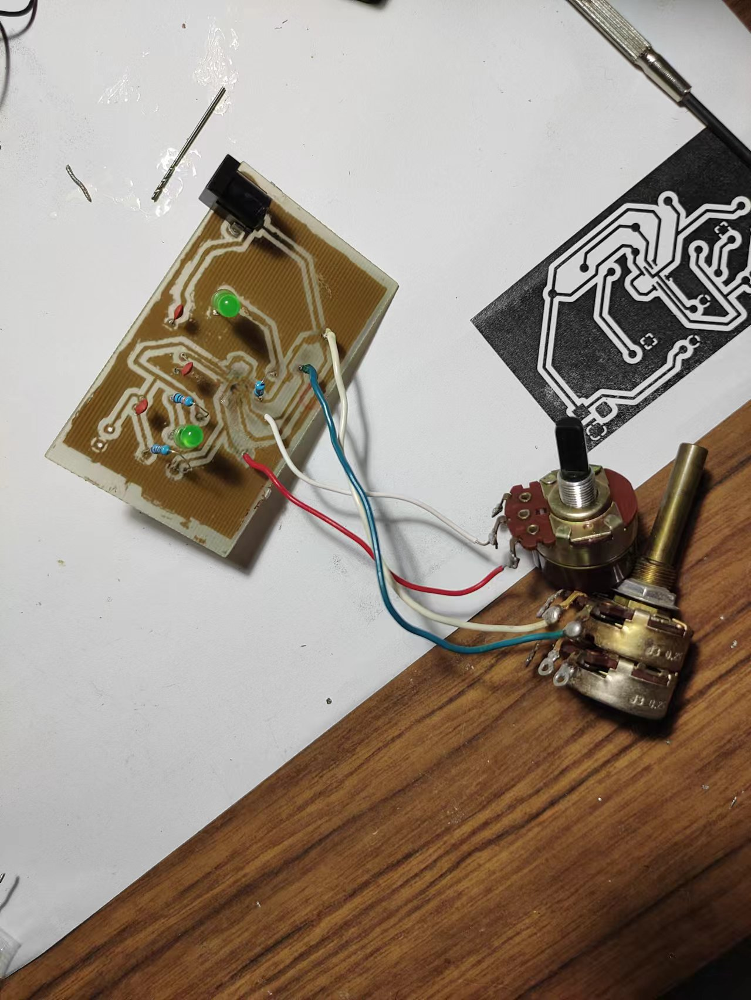
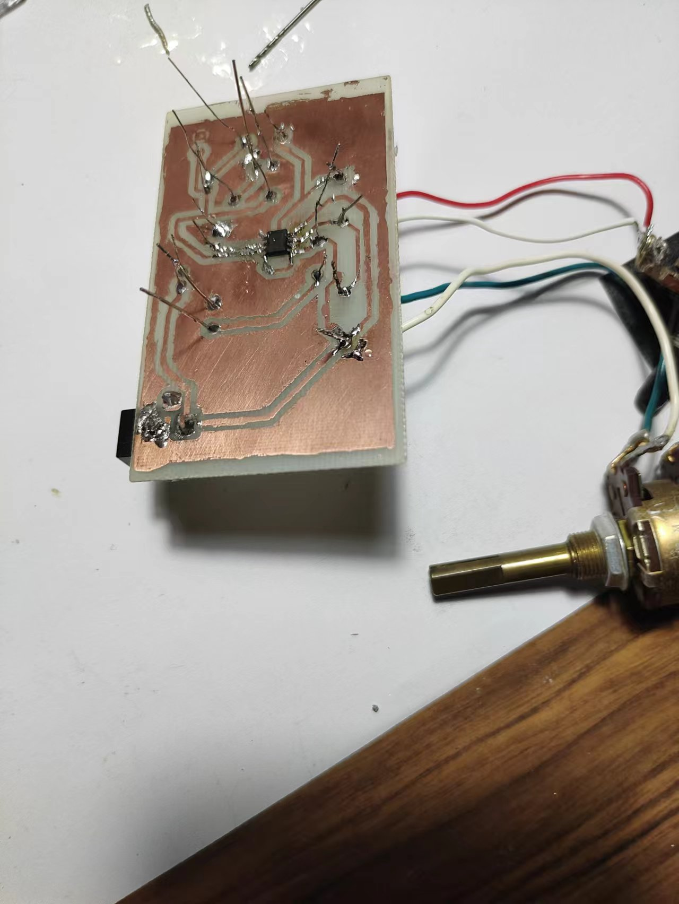

# NE555-Signal-Generator
Using a NE555 chip to create a square wave signal generator

# Prerequisites
- Copper clad board
- Schematic drawing cad software e.g. KiCad
- Toner transfer paper
- Hydrogen peroxide
- Hydrochloric acid
- Soldering iron
- Clothes iron
- Sticky tape
- Vice
- Plastic tweezers
- Drill press
- 3 10nf Capacitors
- 2 Leds
- 2 variable resistors
- 2 230 ohm resistor
- 1k ohm resistor
- DC barrel power jack

# To build
## Etching process.
1. Use the schematics file NE555 Signal Generator new.kicad_pcb.

Pcb board diagram
2. Print the pcb board design onto toner transfer paper.
3. Cut out the printed pcb design outline.
4. Prepare an appropriate sized copper clad board for the circuit to go onto.
5. Roughly sand the copper board to ensure that the copper is clean to allow for bettter toner transfer.
6. Use sticky tape to attatch the toner paper onto the pcb board. Ensure that the paper is flat and in contact with the copper board.
7. Place clothes iron onto Vice clamp to ensure the heated side is facing up.
8. Preheat the clothes iron to silk setting.
9. Once hot place the copper board onto the iron and apply force evenly onto the board. Continue to do so for 15-20 minutes.
10. Remove the coppper board and allow it to cool.
11. Once cool place the copper board into cold water and carefully peel off the toner transfer paper.

Toner transfer result
12. Inspect the board and see if the proper circuitry has been transfered. If the result is poor the board can be sanded and the process can be repeated. Minor imperfections can be filled in with paint instead.
13. If the transfer is satisfacory then the etching process can begin.
14. Measure out 25ml of hydrochloric acid and 50ml of hydrogen peroxide.
15. Add the hydrochloric acid into the hydrogen peroxide slowly to form the etching solution.

etching solution
16. Carefully place the copper board into the solution using plastic tweezers.

etching solution
17. Stir the solution constantly and observe the board to see if the corrision has taken place. The process should take around 15-20mins.
18. Once the board has corroded carefully remove the board from the solution using plastic tweezers and rinse with clear water.
19. Sand off the excess paint and print that remains on the board and the etching should be finished.

Etched board before sanding

Front of final pcb board

Back of pcb board

## Finish the circuitry of the board.
 1. Drill holes into the board using a drill press for the legs of the components.
 2. Using the schematic Resistors R1, R5 are 230 ohm resistors. Capacitors, C1, C2, C3 are 1nf capacitors.

Schematic of circuit
 3. Solder all of the components onto the board according to the schematic.
 
 Front of the final pcb board
 
 Back of the final pcb board
 
 
 
